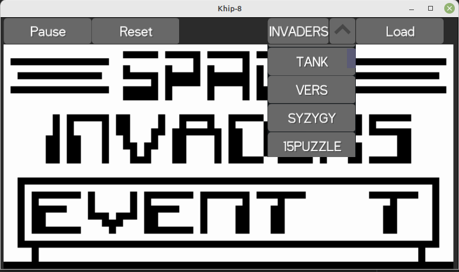

# Kotlin Chip-8 Interpreter

A Kotlin multi-platform Chip-8 interpreter. Currently only supports the JVM.

A number of Chip-8 games are available within the `resources/c8` directory.

## Loading ROM files

ROM files can be loaded via the drop down list in the UI. You can currently only choose between the ROMs included and cannot load ROMs from disk.



## Configuration

The interpreter can be configured by modifying the `src/commonMain/resources/chip8.properties` An example configuration follows:

```
system.speed.cpu=1080
system.speed.timer=60
system.speed.display.refresh=30

system.memory.ram.size=4096
system.memory.stack.size=16
system.memory.interpreter.start.address=0
system.memory.program.start.address=512
system.memory.register.count=16
```
## Libraries

* [Kotlin Multiplatform](https://github.com/JetBrains/kotlin)
* [Koin](https://github.com/InsertKoinIO/koin) for dependency injection
* [Multiplatform Settings](https://github.com/russhwolf/multiplatform-settings) for settings files
* [KLogger](https://github.com/korlibs/klogger) for logging
* [JUnit 5](https://github.com/junit-team/junit5), [MockK](https://github.com/mockk/mockk), [Strikt](https://github.com/robfletcher/strikt) and [Kotest](https://github.com/kotest/kotest) for testing
* [KorGE](https://github.com/korlibs/korge) for the UI
